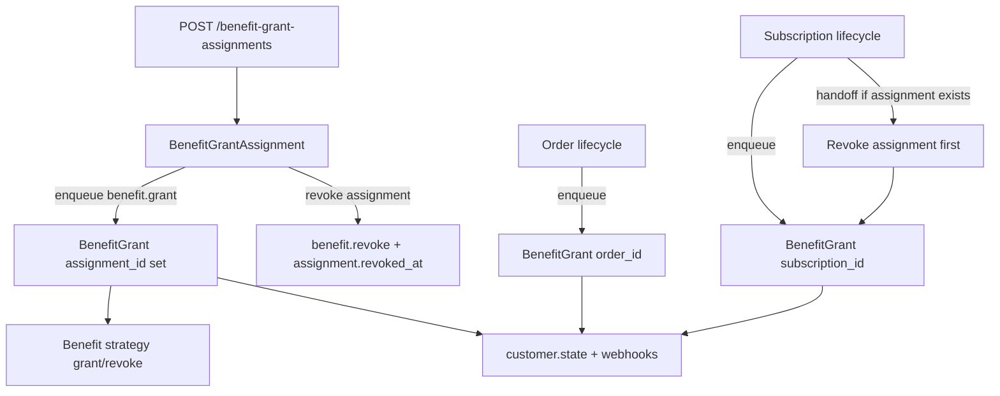

# Standalone Benefits via BenefitGrantAssignment

**Status**: Draft (implementation plan)  
**Created**: June 2026  
**Audience**: Implementing engineers and LLM agents

Handoff document for implementing standalone benefit grants in Polar. Read `server/AGENTS.md` and `clients/AGENTS.md` before starting.

---

## 1. Goal

Allow **manual standalone entitlements** for benefits not tied to a subscription or order, with a clear **lifecycle owner**.

### In scope (v1)

- New `BenefitGrantAssignment` entity as lifecycle owner
- Materialized `BenefitGrant` row per assignment (same strategy pipeline as today)
- Types: `feature_flag`, `custom`, `license_keys` only
- Manual create + manual revoke via API
- Mutual exclusion: assignment ↔ subscription/order grant for same `(customer, benefit, member)`
- Subscribe handoff: active assignment revoked when purchase-scoped grant is created
- No cycles on assignment-backed grants

### Out of scope (v1)

- Bulk import API
- `expires_at` worker (add column + API field now; cron in v1.1)
- Standalone for discord/github/slack/downloadables/meter_credit
- Dashboard UI (optional Phase 3 — API-first)
- New webhook event types (reuse `benefit_grant.*`; expose `assignment_id` on grant schema)

---

## 2. Architecture



### Ownership model

| Owner | Lifecycle driver | BenefitGrant FK |
| --- | --- | --- |
| Subscription | sub activate/cancel/product change | `subscription_id` |
| Order | order paid/refund/dispute | `order_id` |
| Assignment | API revoke / future expiry | `assignment_id` |

Purchase grants **inherit** lifecycle from commerce. Standalone grants are **owned by an assignment** and only change when something explicitly revokes them or they expire.

---

## 3. Data model

### 3.1 New table: `benefit_grant_assignments`

**File:** `server/polar/models/benefit_grant_assignment.py`

```python
class BenefitGrantAssignment(RecordModel):
    __tablename__ = "benefit_grant_assignments"

    organization_id: FK → organizations.id (cascade)
    customer_id: FK → customers.id (cascade)
    benefit_id: FK → benefits.id (cascade)
    member_id: FK → members.id (nullable, cascade)

    granted_by_user_id: FK → users.id (nullable, set null on delete)
    expires_at: TIMESTAMP WITH TIME ZONE (nullable)
    revoked_at: TIMESTAMP WITH TIME ZONE (nullable)
    reason: TEXT (nullable, max ~500 in schema validation)
    external_id: VARCHAR (nullable)  # future import idempotency
```

**Constraints / indexes:**

```sql
-- One active assignment per customer+benefit+member
CREATE UNIQUE INDEX uq_benefit_grant_assignments_active
  ON benefit_grant_assignments (customer_id, benefit_id, member_id)
  NULLS NOT DISTINCT
  WHERE deleted_at IS NULL AND revoked_at IS NULL;

-- Future import idempotency (partial, when external_id set)
CREATE UNIQUE INDEX uq_benefit_grant_assignments_external_id
  ON benefit_grant_assignments (organization_id, external_id)
  WHERE external_id IS NOT NULL AND deleted_at IS NULL;
```

**Relationships:** `lazy="raise"` to `Organization`, `Customer`, `Benefit`, `Member?`, `User?`, viewonly `BenefitGrant?`.

Register in `server/polar/models/__init__.py`.

### 3.2 Extend `BenefitGrant`

**File:** `server/polar/models/benefit_grant.py`

Add:

```python
assignment_id: Mapped[UUID | None] = mapped_column(
    Uuid, ForeignKey("benefit_grant_assignments.id", ondelete="cascade"),
    nullable=True, index=True,
)
assignment: Mapped["BenefitGrantAssignment | None"]  # lazy="raise"
```

**Check constraint** (exactly one owner):

```sql
CHECK (
  (subscription_id IS NOT NULL AND order_id IS NULL AND assignment_id IS NULL)
  OR (order_id IS NOT NULL AND subscription_id IS NULL AND assignment_id IS NULL)
  OR (assignment_id IS NOT NULL AND subscription_id IS NULL AND order_id IS NULL)
)
```

**Update unique index** — replace `ix_benefit_grants_scope_unique` to include `assignment_id`:

```sql
UNIQUE (customer_id, benefit_id, member_id, subscription_id, order_id, assignment_id)
NULLS NOT DISTINCT
WHERE deleted_at IS NULL
```

**Extend scope types:**

```python
class BenefitGrantScope(TypedDict, total=False):
    subscription: Subscription
    order: Order
    assignment: BenefitGrantAssignment

class BenefitGrantScopeArgs:
    subscription_id: UUID | None
    order_id: UUID | None
    assignment_id: UUID | None
```

Update `BenefitGrantScopeComparator` to handle `assignment` key.

### 3.3 `BenefitType` eligibility

**File:** `server/polar/models/benefit.py`

```python
STANDALONE_GRANTABLE_BENEFIT_TYPES: frozenset[BenefitType] = frozenset({
    BenefitType.feature_flag,
    BenefitType.custom,
    BenefitType.license_keys,
})

def supports_standalone_grant(self) -> bool:
    return self in STANDALONE_GRANTABLE_BENEFIT_TYPES
```

---

## 4. Business rules (enforce in service layer)

### 4.1 Create assignment

1. Benefit type must `supports_standalone_grant()`
2. Customer and benefit same org
3. Resolve `member` via existing `resolve_member()` (`server/polar/benefit/grant/scope.py`) with `is_seat_based=False`
4. **Reject 409** if active purchase-scoped grant exists for `(customer, benefit, member)`:
   - `subscription_id IS NOT NULL OR order_id IS NOT NULL`
   - `is_granted = true`, not deleted
5. **Idempotent** if active assignment already exists for same triple → return existing (prefer return existing if granted)
6. Create `BenefitGrantAssignment` with `revoked_at=NULL`
7. Enqueue `benefit_grant_assignment.grant` with `assignment_id=...`
8. Do **not** call `session.commit()` — use `enqueue_job` + flush

### 4.2 Revoke assignment

1. Set `assignment.revoked_at = now()`
2. Enqueue `benefit_grant_assignment.revoke` with same `assignment_id`
3. Idempotent if already revoked

### 4.3 Subscribe / order handoff (purchase grant path)

In `BenefitGrantService.grant_benefit()` **before** creating/updating scoped grant, when scope has `subscription` or `order`:

1. If benefit `supports_standalone_grant()`
2. Find active assignment for `(customer, benefit, member)` via repository
3. If found → call `BenefitGrantAssignmentService.revoke()` (handoff, not 409)
4. Then proceed with normal scoped grant

This ensures: customer subscribes → assignment revoked → subscription grant owns lifecycle.

### 4.4 Mutual exclusion on assignment create

Covered in 4.1 step 4. Error types:

```python
class BenefitAlreadyGrantedViaPurchaseError(PolarError):  # 409
class BenefitAssignmentAlreadyExistsError(PolarError):     # 409 (optional, if not idempotent)
class BenefitTypeNotStandaloneGrantableError(PolarError): # 422
```

### 4.5 Revoke overlap logic

**File:** `server/polar/benefit/grant/service.py` — `revoke_benefit()`

Today `list_granted_by_benefit_and_customer` counts **all** grants including assignments when deciding external revoke.

For assignment-scoped revoke: always run strategy revoke (license keys already `should_revoke_individually=True`).

For subscription revoke: when counting `other_grants`, mutual exclusion should prevent overlapping assignment grants. Add tests to verify.

### 4.6 Cycles

`benefit.cycle` / `enqueue_benefit_grant_cycles`: **no change** — assignment-backed grants never enqueued for cycles. Add defensive early return in `cycle_benefit_grant` if `grant.assignment_id is not None` → log + return.

### 4.7 Delete paths

- **Customer deleted:** existing `benefit.revoke_customer` should also revoke assignments
- **Benefit deleted:** existing `benefit.delete` revokes grants — also soft-delete/revoke active assignments for that benefit
- **Assignment deleted (soft):** revoke grant first

---

## 5. Backend module layout

New module: `server/polar/benefit/grant_assignment/`

```
grant_assignment/
├── __init__.py
├── repository.py      # BenefitGrantAssignmentRepository
├── service.py         # benefit_grant_assignment = BenefitGrantAssignmentService()
├── schemas.py         # Create, Read, List filters
├── endpoints.py       # /v1/benefit-grant-assignments
├── sorting.py         # created_at, expires_at, etc.
└── tasks.py           # benefit_grant_assignment.grant, .revoke, .revoke_expired (stub v1.1)
```

Follow patterns from `server/polar/benefit/grant/` and `server/polar/license_key/`.

### 5.1 Repository methods

```python
class BenefitGrantAssignmentRepository(...):
    async def get_active_by_customer_benefit_member(
        customer_id, benefit_id, member_id | None
    ) -> BenefitGrantAssignment | None

    async def list_active_by_customer(customer_id) -> Sequence[BenefitGrantAssignment]

    async def get_by_external_id(org_id, external_id) -> ...  # future

    def get_readable_statement(auth_subject) -> ...  # org-scoped via benefit.organization_id
```

Add to `BenefitGrantRepository`:

```python
async def has_active_purchase_grant(
    customer_id, benefit_id, member_id | None
) -> bool

async def get_by_benefit_and_scope(..., assignment: BenefitGrantAssignment | None)
# Extend existing get_by_benefit_and_scope
```

### 5.2 Scope resolution

**File:** `server/polar/benefit/grant/scope.py`

```python
async def resolve_scope(session, scope: BenefitGrantScopeArgs) -> BenefitGrantScope:
    ...
    if assignment_id := scope.get("assignment_id"):
        assignment = await assignment_repository.get_by_id(assignment_id)
        if assignment is None:
            raise InvalidScopeError(scope)
        resolved_scope["assignment"] = assignment
```

Update `scope_to_args()` to include `assignment_id`.

### 5.3 Tasks

**File:** `server/polar/benefit/tasks.py`

Extend `benefit.grant` and `benefit.revoke` signatures:

```python
**scope: Unpack[BenefitGrantScopeArgs]  # now includes assignment_id
```

When resolving `is_seat_based`: assignment grants use `is_seat_based=False` (no product context).

**New tasks** (`grant_assignment/tasks.py`):

```python
@actor(actor_name="benefit_grant_assignment.grant", ...)
async def grant_assignment(assignment_id: UUID) -> None:
    # load assignment, validate not revoked, call grant_benefit(..., assignment=assignment)

@actor(actor_name="benefit_grant_assignment.revoke", ...)
async def revoke_assignment(assignment_id: UUID) -> None:
    # set revoked_at if not set, call revoke_benefit(..., assignment=assignment)
```

Create/revoke endpoints enqueue these (keep orchestration in assignment service).

### 5.4 Grant service changes

**File:** `server/polar/benefit/grant/service.py`

`grant_benefit(..., **scope)`:

- Accept `assignment: BenefitGrantAssignment | None` in scope
- Set `grant.assignment_id` on new `BenefitGrant` rows
- **Handoff logic** in `grant_benefit` so all scoped grants benefit

`get_by_benefit_and_scope` lookup must match on `assignment_id` when assignment scope.

---

## 6. API

### 6.1 Routes

**File:** `server/polar/benefit/grant_assignment/endpoints.py`  
Register in `server/polar/api.py`:

```python
from polar.benefit.grant_assignment.endpoints import (
    router as benefit_grant_assignments_router,
)
```

| Method | Path | Description |
| --- | --- | --- |
| `GET` | `/v1/benefit-grant-assignments` | List (filters below) |
| `POST` | `/v1/benefit-grant-assignments` | Create + enqueue grant |
| `GET` | `/v1/benefit-grant-assignments/{id}` | Get one |
| `POST` | `/v1/benefit-grant-assignments/{id}/revoke` | Revoke + enqueue revoke |

**Auth:** reuse `BenefitsRead` / `BenefitsWrite` from `server/polar/benefit/auth.py`.

**List filters:** `organization_id`, `customer_id`, `external_customer_id`, `benefit_id`, `is_active` (revoked_at IS NULL), pagination, sorting.

### 6.2 Schemas

**File:** `server/polar/benefit/grant_assignment/schemas.py`

```python
class BenefitGrantAssignmentCreate(Schema):
    customer_id: CustomerID
    benefit_id: BenefitID
    member_id: MemberID | None = None
    reason: str | None = Field(None, max_length=500)
    expires_at: datetime | None = None  # stored only in v1; no worker yet
    external_id: str | None = Field(None, max_length=256)
    properties: BenefitGrantProperties | None = None  # license key user_provided_key

class BenefitGrantAssignment(IDSchema, TimestampedSchema):
    organization_id: UUID4
    customer_id: UUID4
    benefit_id: UUID4
    member_id: UUID4 | None
    granted_by_user_id: UUID4 | None
    expires_at: datetime | None
    revoked_at: datetime | None
    reason: str | None
    external_id: str | None
    is_active: bool  # computed: revoked_at is None and not deleted
    benefit: Benefit  # eager load
    customer: Customer
    member: Member | None
    grant: BenefitGrant | None  # optional linked materialized grant if loaded
```

Endpoints return ORM models (`response_model=...`, return assignment ORM).

### 6.3 Extend existing grant schema

**File:** `server/polar/benefit/strategies/base/schemas.py` — `BenefitGrantBase`

Add:

```python
assignment_id: UUID4 | None = Field(
    description="The ID of the assignment that owns this grant's lifecycle."
)
```

### 6.4 Optional: filter benefits list

**File:** `server/polar/benefit/endpoints.py`

Query param: `standalone_grantable: bool | None` → filter `Benefit.type.in_(STANDALONE_GRANTABLE_BENEFIT_TYPES)`.

---

## 7. Events & webhooks

**No new webhook types v1.** Existing `benefit_grant.created` / `benefit_grant.revoked` fire via `_send_webhook` in grant service.

**System events:** extend `BenefitGrantMetadata` in `server/polar/event/system.py`:

```python
assignment_id: NotRequired[str]
```

Set in `_build_benefit_grant_metadata()` when `grant.assignment_id` present.

---

## 8. Customer state & portal

**Customer state** (`server/polar/customer/service.py`): **no change** — assignment-backed grants appear in `granted_benefits` once materialized.

**Customer portal** (`server/polar/customer_portal/service/benefit_grant.py`): grants with `assignment_id` and no sub/order sort last (existing join behavior). Acceptable v1; optional follow-up to show “Granted directly” label.

---

## 9. Migration

**File:** `server/migrations/versions/YYYY-MM-DD-HHMM_add_benefit_grant_assignments.py`

1. Create `benefit_grant_assignments` table
2. Add `assignment_id` to `benefit_grants` (nullable FK)
3. Add CHECK constraint on owner exclusivity
4. Drop old `ix_benefit_grants_scope_unique`, create new index with `assignment_id`
5. No backfill needed (greenfield column)

Run:

```bash
cd server && uv run alembic revision --autogenerate -m "add benefit grant assignments"
```

Verify generated SQL manually (check constraints often need hand-editing).

---

## 10. Tests

Follow `server/tests/benefit/grant/test_service.py` patterns (strategy mock autouse fixture).

### 10.1 New file: `server/tests/benefit/grant_assignment/test_service.py`

| Test | Assert |
| --- | --- |
| Create assignment for feature_flag | assignment active, job enqueued |
| Create for meter_credit | 422 |
| Create when subscription grant active | 409 |
| Create when assignment already active | idempotent return / 409 |
| Revoke assignment | revoked_at set, revoke job enqueued |
| Handoff: grant via subscription revokes assignment | assignment revoked, sub grant created |
| License key with `user_provided_key` in properties | key created on grant task |

### 10.2 New file: `server/tests/benefit/grant_assignment/test_endpoints.py`

- Anonymous → 401
- Create/list/revoke happy path with auth fixtures
- 409 overlap case

### 10.3 Extend `server/tests/benefit/grant/test_service.py`

- `grant_benefit` with `assignment=` sets `assignment_id`
- `get_by_benefit_and_scope` finds assignment-scoped grant
- `cycle_benefit_grant` no-ops for assignment grant

### 10.4 Run

```bash
cd server
uv run task test tests/benefit/grant_assignment/
uv run task test tests/benefit/grant/
uv run task lint && uv run task lint_types
```

---

## 11. Frontend (Phase 3 — optional for v1)

If implementing UI in same PR:

**Customer page** (`clients/apps/web/src/components/Customer/CustomerPage.tsx`):

- “Grant benefit” button → modal
- Fetch `GET /v1/benefits?standalone_grantable=true`
- POST assignment, invalidate `useBenefitGrants`

**Benefit page** (`BenefitPage.tsx`): same flow inverted (customer picker).

**Grant table:** show “Assignment” badge when `assignment_id` present.

**i18n:** strings only in `clients/packages/i18n/src/locales/en.ts`.

**After API merge:**

```bash
cd clients/packages/client && pnpm run generate
```

---

## 12. Implementation sequence (checklist)

Suggested branch for implementation: `cursor/benefit-grant-assignments-a9cc`

### Phase A — Model & migration

- [ ] `BenefitGrantAssignment` model
- [ ] Extend `BenefitGrant` + scope types
- [ ] `BenefitType.supports_standalone_grant()`
- [ ] Alembic migration applied locally
- [ ] Export models in `__init__.py`

### Phase B — Repository & scope

- [ ] `BenefitGrantAssignmentRepository`
- [ ] Extend `BenefitGrantRepository` (assignment scope, purchase-grant check)
- [ ] Update `resolve_scope` / `scope_to_args`

### Phase C — Assignment service

- [ ] `BenefitGrantAssignmentService.create()` / `revoke()`
- [ ] Conflict errors (409/422)
- [ ] Tasks: `benefit_grant_assignment.grant`, `.revoke`

### Phase D — Grant service integration

- [ ] `grant_benefit` / `revoke_benefit` accept assignment scope
- [ ] Subscribe handoff in `grant_benefit`
- [ ] `cycle_benefit_grant` guard for assignment grants
- [ ] `_build_benefit_grant_metadata` includes `assignment_id`
- [ ] Benefit delete / customer revoke paths include assignments

### Phase E — API

- [ ] Schemas + endpoints
- [ ] Register router in `api.py`
- [ ] Extend `BenefitGrantBase.assignment_id`
- [ ] Optional `standalone_grantable` filter on benefits list
- [ ] OpenAPI error responses on endpoints (`409`, `422`)

### Phase F — Tests & QA

- [ ] All tests above passing
- [ ] lint + lint_types clean
- [ ] `pnpm run generate` if frontend touched

### Phase G — Frontend (optional)

- [ ] Customer grant modal
- [ ] Assignment badge on grants list

---

## 13. Key file reference

| Area | Path |
| --- | --- |
| Grant model | `server/polar/models/benefit_grant.py` |
| Benefit types | `server/polar/models/benefit.py` |
| Grant service | `server/polar/benefit/grant/service.py` |
| Grant tasks | `server/polar/benefit/tasks.py` |
| Scope resolution | `server/polar/benefit/grant/scope.py` |
| Grant repository | `server/polar/benefit/grant/repository.py` |
| Strategies (no changes v1) | `server/polar/benefit/strategies/{feature_flag,custom,license_keys}/service.py` |
| API mount | `server/polar/api.py` |
| Grant tests | `server/tests/benefit/grant/test_service.py` |
| Fixtures | `server/tests/fixtures/random_objects.py` — add `create_benefit_grant_assignment` |

---

## 14. Acceptance criteria

1. `POST /v1/benefit-grant-assignments` grants `feature_flag` to a customer with no subscription → `BenefitGrant` created with `assignment_id`, appears in `GET /v1/customers/{id}/state`
2. Same customer with active assignment → `POST` for same benefit returns 409 if active subscription grant exists
3. Customer with active assignment subscribes to product including same benefit → assignment revoked, subscription-scoped grant created
4. `POST .../revoke` revokes assignment and grant; license key revoked individually
5. `meter_credit` assignment create returns 422
6. No cycle jobs run for assignment-backed grants
7. All new tests pass; no regressions in `tests/benefit/grant/`

---

## 15. v1.1 follow-ups (do not implement now)

- Cron: `benefit_grant_assignment.revoke_expired` (every 15 min, revoke where `expires_at < now()`)
- Bulk import: `POST /v1/benefit-grant-assignments/import` with `external_id` upsert
- Webhook types: `benefit_grant_assignment.created/revoked`
- Dashboard UX polish + user/developer docs in `docs/`

---

## 16. Frozen design decisions

| Decision | Choice |
| --- | --- |
| Lifecycle owner for standalone | `BenefitGrantAssignment` |
| Overlap assignment + purchase grant | **Not allowed** (409 on create) |
| Subscribe with existing assignment | **Handoff** (revoke assignment, create scoped grant) |
| Eligible types | `feature_flag`, `custom`, `license_keys` |
| Cycles on assignments | **Never** |
| Expiry | Column exists; worker deferred |

---

## 17. Background context

Polar’s entitlement model today is `BenefitGrant`: a customer (optionally a member) receiving a `Benefit`, almost always scoped to a subscription or order. The database and `BenefitGrantService.grant_benefit()` can represent scopeless grants (both FKs null), but all production flows are product-driven via `enqueue_benefits_grants()`.

This design introduces a first-class lifecycle owner for standalone grants without faking orders or relying on implicit NULL scope semantics.
